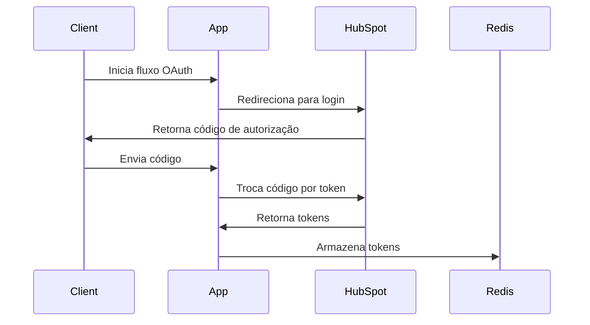
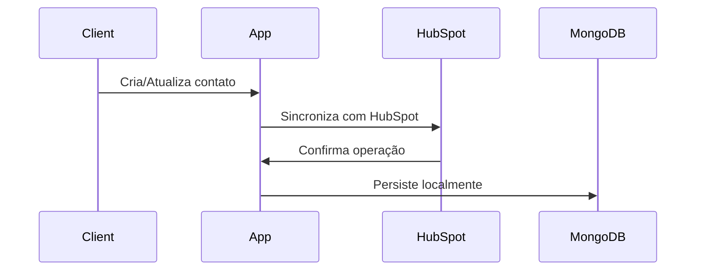
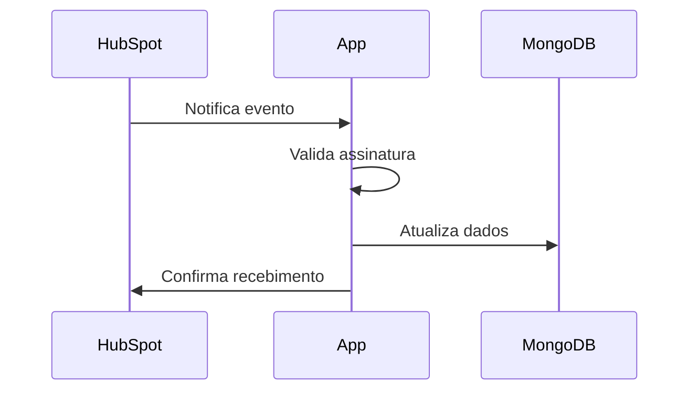

# HubSpot Integration

Este projeto é uma integração com a API do HubSpot, fornecendo funcionalidades para autenticação, gerenciamento de contatos e processamento de webhooks.

## 🚀 Visão Geral

O projeto implementa uma integração robusta com o HubSpot, seguindo os princípios da arquitetura hexagonal (ports and adapters). Ele oferece:

- Autenticação OAuth2 com HubSpot
- Gerenciamento de tokens de acesso
- CRUD de contatos
- Processamento de webhooks
- Cache com Redis
- Segurança baseada em tokens

## 📋 Pré-requisitos

- Java 17+
- Maven
- MongoDB
- Redis
- Conta no HubSpot com acesso à API

## 🔧 Instalação

1. Clone o repositório:
```bash
git clone https://github.com/seu-usuario/hubspot-integration.git
cd hubspot-integration
```

2. Configure as variáveis de ambiente:
```bash
cp .env.example .env
# Edite o arquivo .env com suas credenciais
```

3. Instale as dependências:
```bash
mvn clean install
```

## 🏗️ Arquitetura

### Estrutura do Projeto
```
src/
├── main/
│   ├── java/
│   │   └── com/example/fraga/HubSpot/
│   │       ├── domain/           # Lógica de negócio
│   │       ├── infrastructure/   # Implementações concretas
│   │       └── port/            # Interfaces de entrada e saída
│   └── resources/
└── test/                        # Testes unitários e de integração
```

### Modelagem de Domínio

#### Contact
```java
@Data
@Builder
@Document(collection = "contacts")
public class Contact {
    @Id
    private String id;
    private String email;
    private String firstName;
    private String lastName;
}
```

#### Token
```java
@Data
@EqualsAndHashCode(of="state")
public class Token {
    private String clientId;
    private String accessToken;
    private String refreshToken;
    private String state;
    private LocalDateTime expirationDate;
}
```

## 🔄 Fluxos Principais

### 1. Autenticação


### 2. Gerenciamento de Contatos


### 3. Webhooks


## ⚙️ Configuração

### Variáveis de Ambiente
```env
HUBSPOT_CLIENT_ID=seu_client_id
HUBSPOT_CLIENT_SECRET=seu_client_secret
HUBSPOT_REDIRECT_URI=http://localhost:8080/api/v1/auth/callback
MONGODB_URI=mongodb://localhost:27017/hubspot
REDIS_HOST=localhost
REDIS_PORT=6379
```

### Configuração do HubSpot

1. Acesse o [Portal de Desenvolvedores do HubSpot](https://developers.hubspot.com/)
2. Crie uma aplicação
3. Configure as URLs de redirecionamento
4. Obtenha as credenciais (Client ID e Client Secret)

## 🚀 Executando o Projeto

1. Inicie o MongoDB:
```bash
mongod
```

2. Inicie o Redis:
```bash
redis-server
```

3. Execute a aplicação:
```bash
mvn spring-boot:run
```

## 📚 Documentação da API

A documentação da API está disponível em:
- Swagger UI: `http://localhost:8080/swagger-ui.html`
- OpenAPI: `http://localhost:8080/v3/api-docs`

## 🔒 Segurança

- Autenticação OAuth2 com HubSpot
- Tokens JWT para API
- Validação de assinatura em webhooks
- Rate limiting
- CORS configurado

## 🧪 Testes

Execute os testes com:
```bash
mvn test
```

### Cobertura de Testes
```bash
mvn jacoco:report
```

## 📦 Dependências Principais

- Spring Boot
- Spring Security
- Spring Data MongoDB
- Spring Data Redis
- Reactor
- Lombok
- JUnit
- Mockito

## 🤝 Contribuindo

1. Fork o projeto
2. Crie uma branch para sua feature (`git checkout -b feature/AmazingFeature`)
3. Commit suas mudanças (`git commit -m 'Add some AmazingFeature'`)
4. Push para a branch (`git push origin feature/AmazingFeature`)
5. Abra um Pull Request

## 📝 Licença

Este projeto está sob a licença MIT. Veja o arquivo [LICENSE](LICENSE) para mais detalhes.

## 📞 Suporte

Para suporte, envie um email para suporte@exemplo.com ou abra uma issue no GitHub.

## 🔗 Links Úteis

- [Documentação do HubSpot](https://developers.hubspot.com/docs/api/overview)
- [Spring Boot Documentation](https://spring.io/projects/spring-boot)
- [MongoDB Documentation](https://docs.mongodb.com/)
- [Redis Documentation](https://redis.io/documentation) 