# HubSpot Integration

Projeto de integração com a API do HubSpot utilizando arquitetura hexagonal.

## Tecnologias Utilizadas

- Java 17
- Spring Boot 3.x
- MongoDB
- Redis
- WebClient
- Resilience4j
- Swagger/OpenAPI
- JUnit 5
- Mockito

## Estrutura do Projeto

```
src/
├── main/
│   ├── java/
│   │   └── com/example/fraga/HubSpot/
│   │       ├── adapters/
│   │       │   ├── input/
│   │       │   │   ├── auth/
│   │       │   │   ├── contact/
│   │       │   │   └── webhook/
│   │       │   └── output/
│   │       │       ├── client/
│   │       │       ├── repository/
│   │       │       └── service/
│   │       ├── application/
│   │       │   └── service/
│   │       ├── domain/
│   │       │   ├── exception/
│   │       │   └── model/
│   │       ├── infrastructure/
│   │       │   ├── config/
│   │       │   ├── redis/
│   │       │   └── security/
│   │       └── port/
│   │           ├── input/
│   │           └── output/
│   └── resources/
│       └── application.yml
└── test/
    └── java/
        └── com/example/fraga/HubSpot/
            ├── adapters/
            │   ├── input/
            │   └── output/
            ├── application/
            └── infrastructure/
```

## Requisitos

- Java 17
- Maven
- Docker
- Docker Compose

## Configuração do Ambiente

1. Clone o repositório:
```bash
git clone https://github.com/seu-usuario/hubspot-integration.git
cd hubspot-integration
```

2. Configure as variáveis de ambiente no arquivo `application.yml`:
```yaml
hubspot:
  api:
    client-id: seu-client-id
    client-secret: seu-client-secret
    redirect-uri: http://localhost:8080/callback
    authorization-url: https://app.hubspot.com/oauth/authorize
    token-validation-uri: /oauth/v1/access-tokens
```

3. Execute os serviços necessários usando Docker Compose:
```bash
docker-compose up -d
```

O comando acima iniciará:
- MongoDB na porta 27017
- Redis na porta 6379

4. Execute a aplicação:
```bash
mvn spring-boot:run
```

## Endpoints

### Autenticação

- `POST /api/v1/auth`: Gera URL de autorização
- `GET /api/v1/auth/callback`: Processa callback OAuth

### Contatos

- `POST /api/v1/contacts`: Cria novo contato

### Webhooks

- `POST /api/v1/webhook/contact-creation`: Processa criação de contato

## Documentação

A documentação da API está disponível em:
- Swagger UI: http://localhost:8080/swagger-ui.html
- OpenAPI: http://localhost:8080/v3/api-docs

## Testes

Para executar os testes:
```bash
mvn test
```

## Contribuição

1. Fork o projeto
2. Crie uma branch para sua feature (`git checkout -b feature/AmazingFeature`)
3. Commit suas mudanças (`git commit -m 'Add some AmazingFeature'`)
4. Push para a branch (`git push origin feature/AmazingFeature`)
5. Abra um Pull Request

## Licença

Este projeto está licenciado sob a licença MIT - veja o arquivo [LICENSE](LICENSE) para detalhes.

## 🚀 Visão Geral

O projeto implementa uma integração robusta com o HubSpot, seguindo os princípios da arquitetura hexagonal (ports and adapters). Ele oferece:

- Autenticação OAuth2 com HubSpot
- Gerenciamento de tokens de acesso
- CRUD de contatos
- Processamento de webhooks
- Cache com Redis
- Segurança baseada em tokens

## 📋 Pré-requisitos

- Java 17+
- Maven
- MongoDB
- Redis
- Conta no HubSpot com acesso à API

## 🔧 Instalação

1. Clone o repositório:
```bash
git clone https://github.com/seu-usuario/hubspot-integration.git
cd hubspot-integration
```

2. Configure as variáveis de ambiente:
```bash
cp .env.example .env
# Edite o arquivo .env com suas credenciais
```

3. Instale as dependências:
```bash
mvn clean install
```

## 🏗️ Arquitetura

### Estrutura do Projeto
```
src/
├── main/
│   ├── java/
│   │   └── com/example/fraga/HubSpot/
│   │       ├── domain/           # Lógica de negócio
│   │       ├── infrastructure/   # Implementações concretas
│   │       └── port/            # Interfaces de entrada e saída
│   └── resources/
└── test/                        # Testes unitários e de integração
```

### Modelagem de Domínio

#### Contact
```java
@Data
@Builder
@Document(collection = "contacts")
public class Contact {
    @Id
    private String id;
    private String email;
    private String firstName;
    private String lastName;
}
```

#### Token
```java
@Data
@EqualsAndHashCode(of="state")
public class Token {
    private String clientId;
    private String accessToken;
    private String refreshToken;
    private String state;
    private LocalDateTime expirationDate;
}
```

## 🔄 Fluxos Principais

### 1. Autenticação

```mermaid
sequenceDiagram
    participant Client
    participant App
    participant HubSpot
    participant Redis

    Client->>App: Inicia fluxo OAuth
    App->>HubSpot: Redireciona para login
    HubSpot->>Client: Retorna código de autorização
    Client->>App: Envia código
    App->>HubSpot: Troca código por token
    HubSpot->>App: Retorna tokens
    App->>Redis: Armazena tokens
```


### 2. Gerenciamento de Contatos

```mermaid
sequenceDiagram
    participant Client
    participant App
    participant HubSpot
    participant MongoDB

    Client->>App: Cria/Atualiza contato
    App->>HubSpot: Sincroniza com HubSpot
    HubSpot->>App: Confirma operação
    App->>MongoDB: Persiste localmente
```


### 3. Webhooks


## ⚙️ Configuração

### Variáveis de Ambiente
```env
HUBSPOT_CLIENT_ID=seu_client_id
HUBSPOT_CLIENT_SECRET=seu_client_secret
HUBSPOT_REDIRECT_URI=http://localhost:8080/api/v1/auth/callback
MONGODB_URI=mongodb://localhost:27017/hubspot
REDIS_HOST=localhost
REDIS_PORT=6379
```

### Configuração do HubSpot

1. Acesse o [Portal de Desenvolvedores do HubSpot](https://developers.hubspot.com/)
2. Crie uma aplicação
3. Configure as URLs de redirecionamento
4. Obtenha as credenciais (Client ID e Client Secret)

## 🚀 Executando o Projeto

1. Inicie o MongoDB:
```bash
mongod
```

2. Inicie o Redis:
```bash
redis-server
```

3. Execute a aplicação:
```bash
mvn spring-boot:run
```

## 📚 Documentação da API

A documentação da API está disponível em:
- Swagger UI: `http://localhost:8080/swagger-ui.html`
- OpenAPI: `http://localhost:8080/v3/api-docs`

## 🔒 Segurança

- Autenticação OAuth2 com HubSpot
- Tokens JWT para API
- Validação de assinatura em webhooks
- Rate limiting
- CORS configurado

## 🧪 Testes

Execute os testes com:
```bash
mvn test
```

### Cobertura de Testes
```bash
mvn jacoco:report
```

## 📦 Dependências Principais

- Spring Boot
- Spring Security
- Spring Data MongoDB
- Spring Data Redis
- Reactor
- Lombok
- JUnit
- Mockito

## 🤝 Contribuindo

1. Fork o projeto
2. Crie uma branch para sua feature (`git checkout -b feature/AmazingFeature`)
3. Commit suas mudanças (`git commit -m 'Add some AmazingFeature'`)
4. Push para a branch (`git push origin feature/AmazingFeature`)
5. Abra um Pull Request

## 📝 Licença

Este projeto está sob a licença MIT. Veja o arquivo [LICENSE](LICENSE) para mais detalhes.

## 📞 Suporte

Para suporte, envie um email para suporte@exemplo.com ou abra uma issue no GitHub.

## 🔗 Links Úteis

- [Documentação do HubSpot](https://developers.hubspot.com/docs/api/overview)
- [Spring Boot Documentation](https://spring.io/projects/spring-boot)
- [MongoDB Documentation](https://docs.mongodb.com/)
- [Redis Documentation](https://redis.io/documentation) 